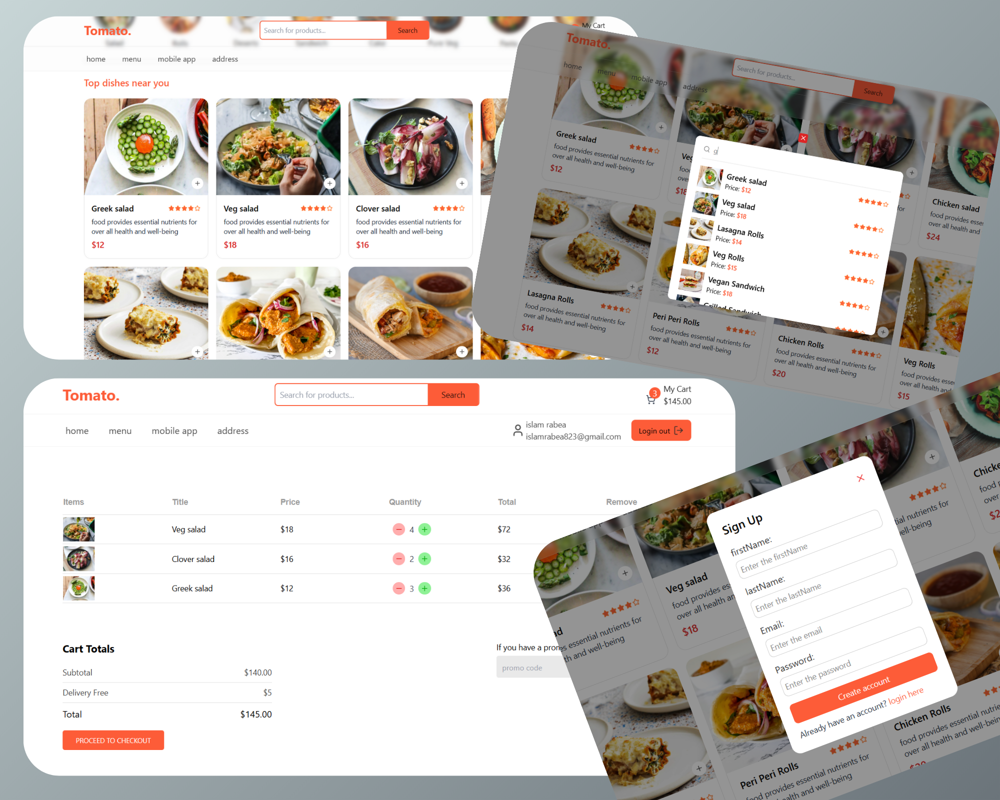

# 🛒 E-commerce Shopping Cart



---

## 🔍 Overview

ده مشروع ويب بسيط لعربة تسوق إلكترونية.  
هتقدر تتصفح المنتجات، تضيفها للعربة، تتحكم في الكمية، وتشوف السعر الكلي.  
كمان فيه تسجيل دخول وخروج، والبيانات كلها بتتخزن على **JSONBin API**.

---

## ✨ Features

| الميزة                                             | الوصف                                                                             |
| -------------------------------------------------- | --------------------------------------------------------------------------------- |
| 🔎 **البحث عن المنتجات (Search Products)**         | تقدر تبحث عن المنتجات باستخدام اسم المنتج وتظهر النتائج بشكل ديناميكي             |
| 📦 **عرض تفاصيل المنتج (Product Details)**         | لما تدوس على أي منتج بيظهرلك صفحة فيها كل التفاصيل (الاسم، السعر، الصورة، والوصف) |
| ➕ **إضافة إلى العربة (Add to Cart)**              | تقدر تضيف المنتج للعربة بضغطة واحدة بس، مع عرض عدد المنتجات والسعر الكلي          |
| 🔁 **زيادة أو تقليل الكمية (Increment/Decrement)** | تقدر تتحكم في الكمية (تزوّد أو تقلل) ويتحدث السعر تلقائيًا                        |
| 🔐 **تسجيل الدخول/الخروج (Sign In/Out)**           | إنشاء حساب جديد، تسجيل الدخول، وتسجيل الخروج بسهولة                               |
| ☁️ **JSONBin API**                                 | تخزين المنتجات والعربة على JSONBin لعرض البيانات بشكل ديناميكي                    |

---

## 🚀 Installation & Setup

1. **Clone the repo:**
   ```bash
   git clone https://github.com/islam-rabia/E-Commerce-Shopping-Cart.git
   cd E-Commerce-Shopping-Cart
   ```
